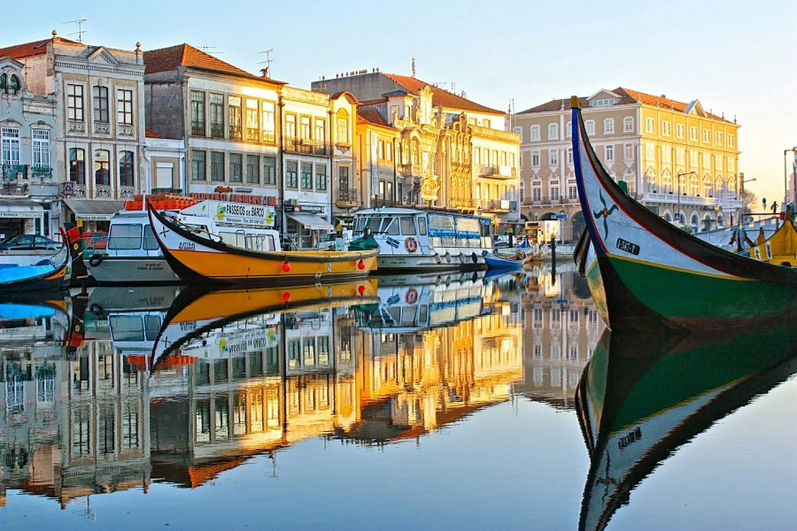
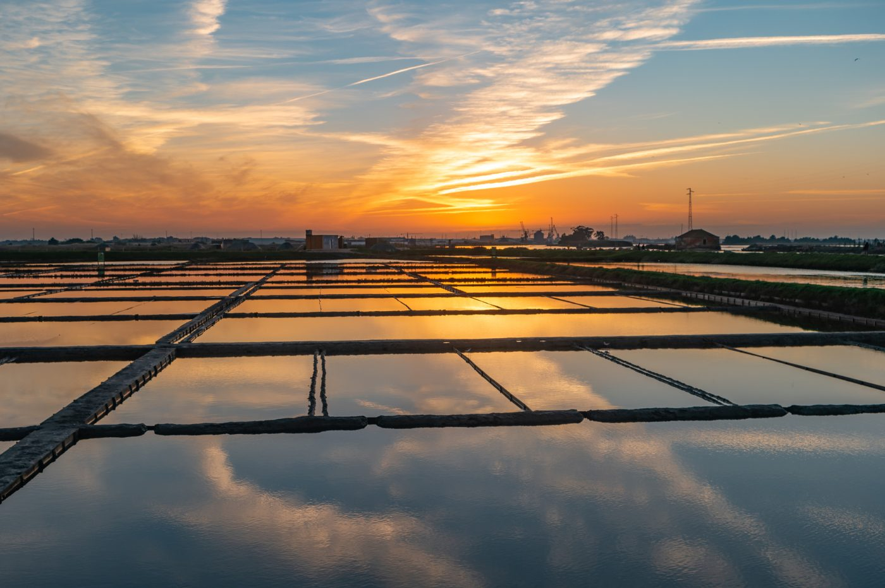
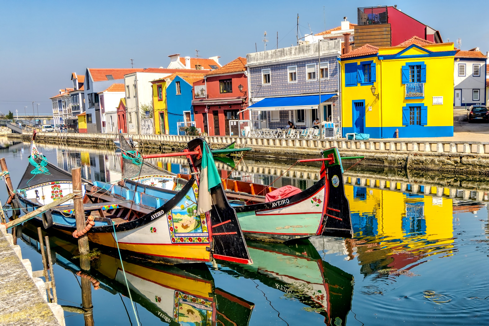
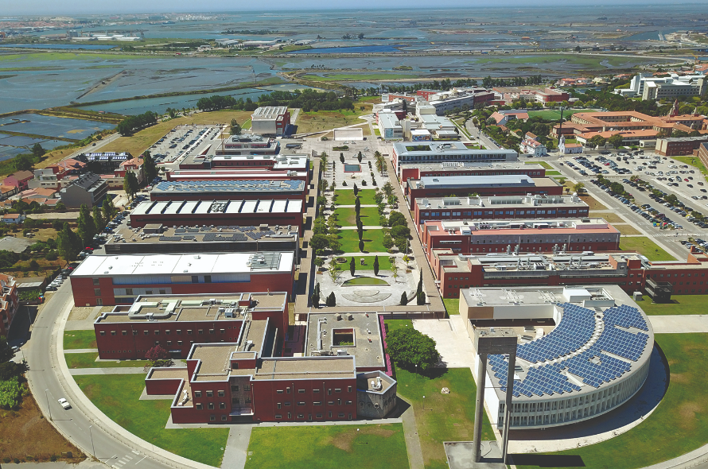
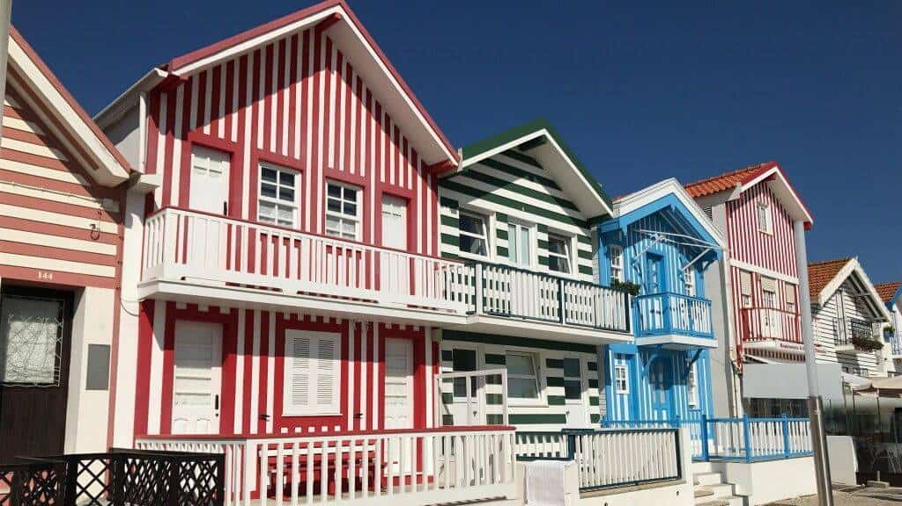
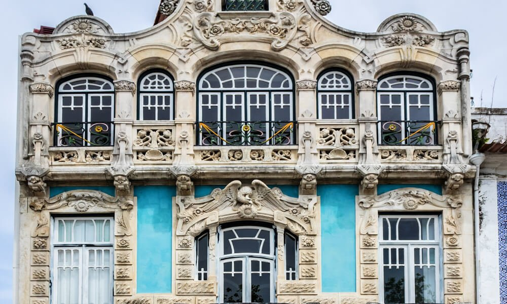
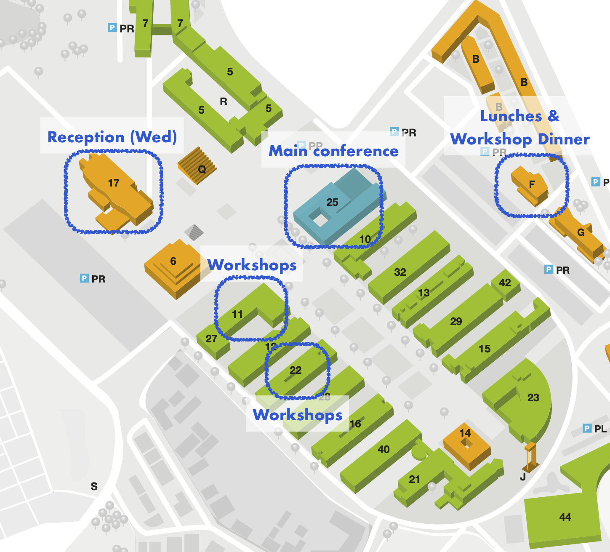
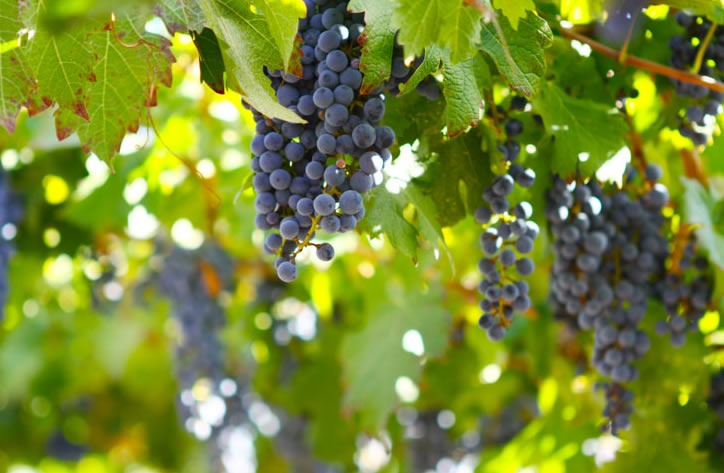
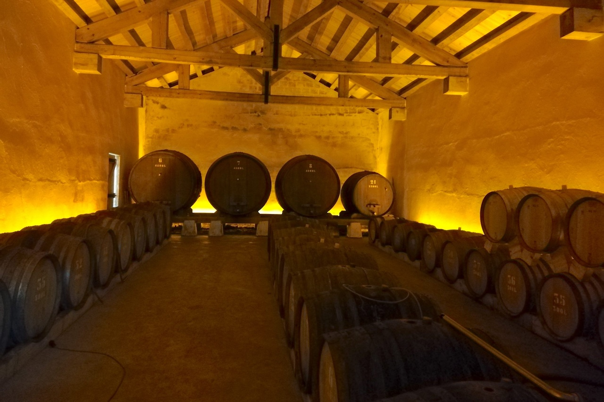
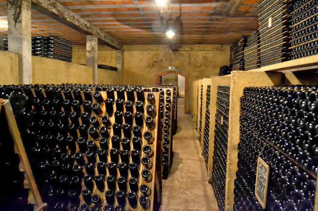

SEFM 2024 will take place at the University of Aveiro (UA) in Portugal.

<!-- 
- **The main conference** will take place in (...)
- **Sattelite workshops** on Monday and Tuesday are located in (...)
 -->

Aveiro is a coastal city located in the central region of Portugal, which is 5 minutes from the Atlantic beaches.
The Ria de Aveiro is a salt lake that follows the coastline for 45 km, providing a unique habitat for wildlife and is at the genesis of the city due to the production of salt. Aveiro is today a modern city, driven by the active academic life of its students.

Aveiro has today a very relevant tourist activity with numerous interesting things to visit and do. Tourist information can be found [here](https://www.visitportugal.com/en/content/visit-aveiro). You can also take a look at this
[video](https://youtu.be/0YPC6sfgj2I)
 with an overview of the places to visit in Aveiro, and at this short
[documentary](https://youtu.be/7H0QYbT2oMo)
 about the city's lifestyle.

## How to Get to Aveiro

    <!--   -->
       
    

   
 

Located between Lisbon and Porto, Aveiro is easily accessible by train from both cities. 
If you travel by plane, the most convenient airport is Francisco Sá Carneiro Airport (Porto). Passengers arriving at this airport should take the metro to Campanhã train station and then take a train to Aveiro. City trains run hourly and every day of the week.To travel from Lisbon Airport, passengers must take the metro at Estação do Oriente and then take a train to Aveiro (about 2.5 hours to travel 255 km).
To see timetables and buy tickets, go to
[here](https://www.cp.pt/passageiros/en).

## Informations about the conference and workshops venue

With exception of the social event, all the activities of SEFM and the co-located workshops will take place at the University of Aveiro Campus. A more detailed map with instructions can be found [here](../assets/images/UAMap.pdf).

     
    

 

- Workshops - Check-In: Opens at 8:45 in front of Sousa Pinto Room, Mathematics Department (Building 11); to be held here (DataMod, ReacTS, and Ibex) and in Auditório José Graça, Mechanics Department (building 22, CIFMA).

- Main Conference - Check-In: Opens at 8:45 in front of the "Actos Académicos" Room, Rectory Building (Building 25).

- "Porto de Honra" Reception (Wednesday, 18:30): To be held in the Library of the University (Building 17).

- Lunches & Workshop Dinner (Monday, 20:00): Served at "Restaurante da Universidade," located on the 1st floor of Building F.

## Excursion and Social Event

       
    

 

  
Banquet and excursion: the SEFM'24 excursion will include a visit to Bairrada, a wine zone (30 minutes from Aveiro). We will visit a typical wine house, the -- [_Quinta das Bágeiras_](https://www.quintadasbageiras.pt/indexEN.html). This will include a tour to the wine caves, guided by a producer, that will introduce the classic process of _Espumante da Bairrada_, the traditional Bairrada sparkling wine. Moreover, the SEFM'24 banquet will be served inside the caves, in an unique atmosphere to taste the local wines and a core dish of the Portuguese gastronomy: the _Leitão à Bairrada_. Naturally, vegetarian alternatives and non alcoholic drinks will be available.

<!--

1400 × 932 
2560

2560 × 1920

## Travelling to Aveiro

### Travel by plane
...

### Travel by train
...

### Travel by car
...

## Aveiro
...

# Social Event & Banquet
... -->
